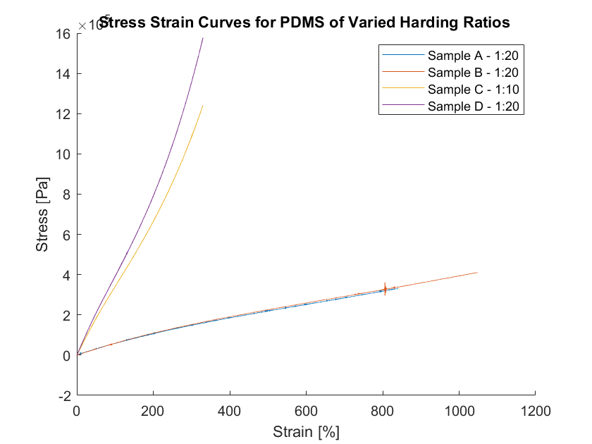
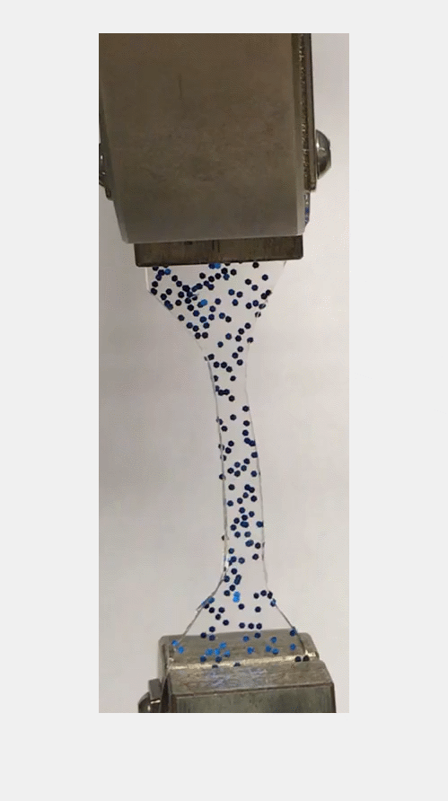
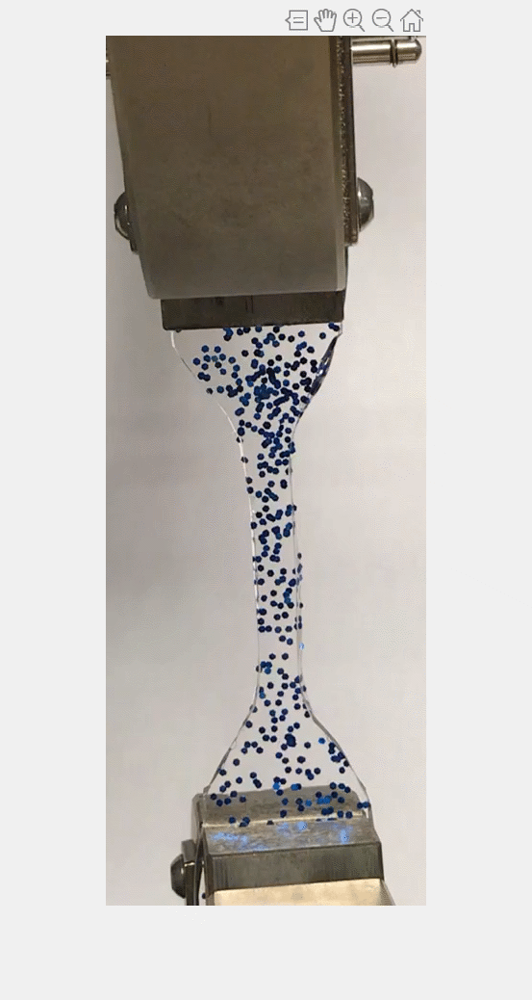

# Syllabus Description

Experimental mechanics with Dr Mills covered a variety of practical engineering topics such as AFM, photoelasticity, and Hertzian contact mechanics. Manual image tracking and time dependent strain measurements covered in final projects using ncorr. 

### Summary from course catalog

> In this course we will study the design and analysis of experiments in solid mechanics including some applications in biomechanics. Methods for experimental stress analysis and the mechanical testing of materials will be discussed. Measurement techniques including instrumentation and data acquisition for key mechanical parameters such as displacements and forces \(point and full-field measurements\). Mechanical behaviors include creep and relaxation, high strain rate, fracture, fatigue, and aspects of biological soft tissues.

Matlab Script for Movie Reader `moviereader.m` . 

```text
warning('off','Images:initSize:adjustingMag')
frequency = 1000;
v =  VideoReader('IMG_9235.mov');
video = read(v,1);
[z,rect] = imcrop(video);
filename = 'sampleD.gif';
%newimg = zeros(size(z,1),size(z,2),size(z,3),length(1:frequency:v.FrameRate*v.Duration));
h = figure;
for n = 1:frequency:v.FrameRate*v.Duration
    video_frame = read(v,n);
    video_frame = imcrop(video_frame,rect);
    %newimg(:,:,:,i)= video_frame;
    imshow(video_frame)
    frame = getframe(h); 
    im = frame2im(frame); 
    [imind,cm] = rgb2ind(im,256); 
    % Write to the GIF File 
    if n == 1 
          imwrite(imind,cm,filename,'gif', 'Loopcount',inf); 
    else 
          imwrite(imind,cm,filename,'gif','WriteMode','append'); 
    end 
end


```


```text

figure(2)
plot(data2(:,1),data2(:,2),data2(:,3),data2(:,4))

title('Stress Strain Curves for PDMS of Varied Harding Ratios ')
xlabel('Indentation Depth [nm]')
ylabel('Force [N]')
legend('Sample 1 - 1:20','Sample 2 - 1:10')
```








a


d


f



s

d

d


asd











  
  
  
  




































some






csv





file 





data 





asd





s



s



s



s


s




