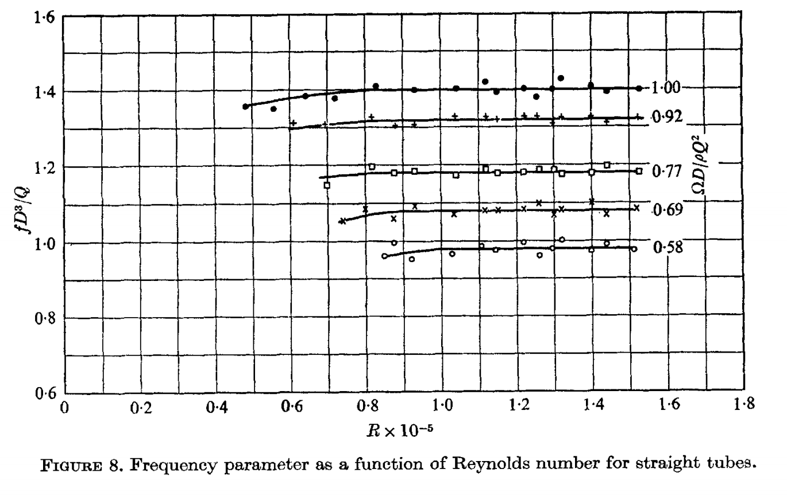
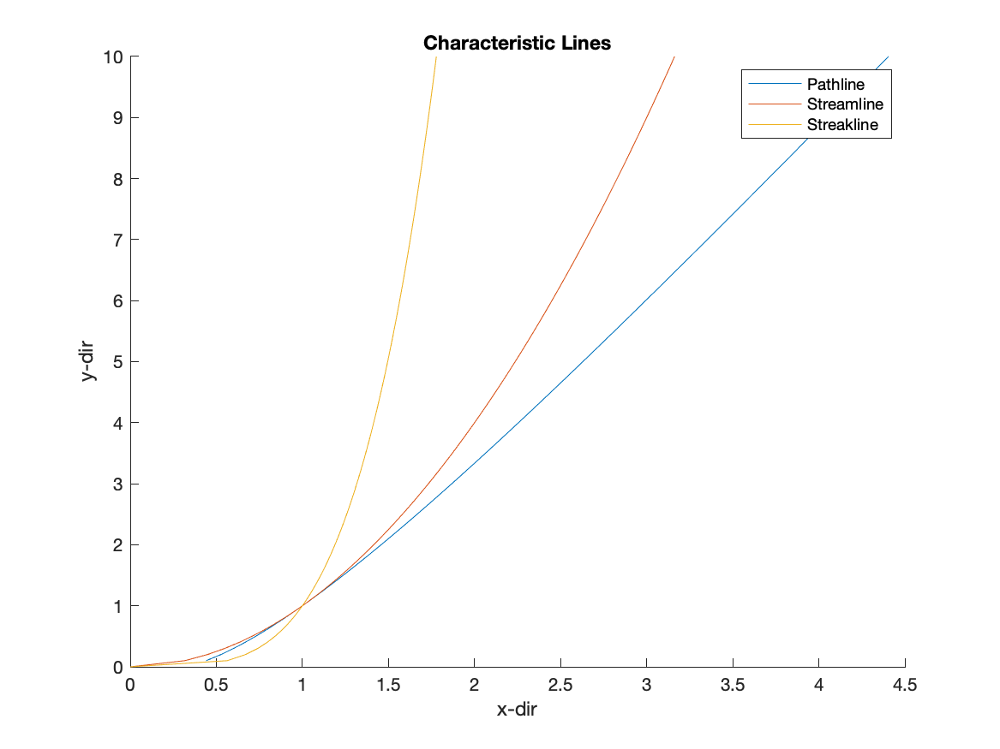
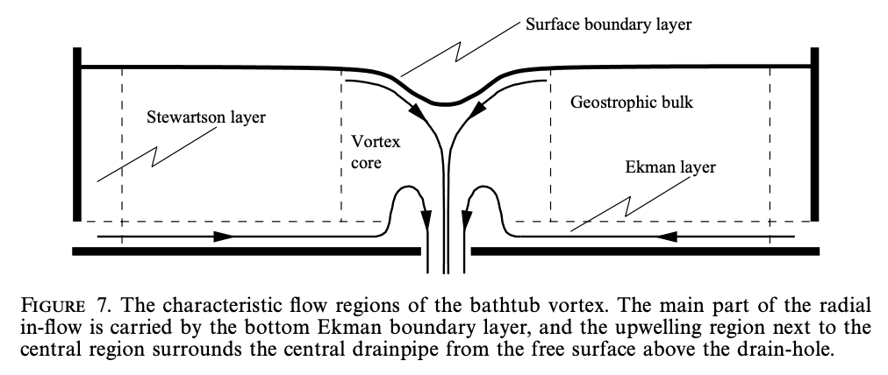

# Syllabus Description

Taught by [Prof. Rusak of RPI ](https://faculty.rpi.edu/zvi-rusak)in the fall of 2019. Following are handouts and notes collected [to honor him](https://president.rpi.edu/news/memo/06/08/2020/passing-dr-zvi-rusak). 

### [Course Catalog Description ](http://catalog.rpi.edu/preview_course.php?catoid=18&coid=34421&print)

> An introductory graduate course in fluid mechanics. Topics include: continuum hypothesis; perfect gas and departures from perfect gas; vectors and tensors; conservation laws for a continuum: mass momentum and energy; constitutive theory for fluids; viscosity and molecular transport; compressible Navier-Stokes equations; kinematics of the flow field: vorticity, streamlines; incompressible Navier-Stokes equations and their applications: Poiseuille flow, low Reynolds number flows, flows at large Reynolds number, boundary layers, external flows: flow stability and introduction to the theory of turbulence

### Assets Table























