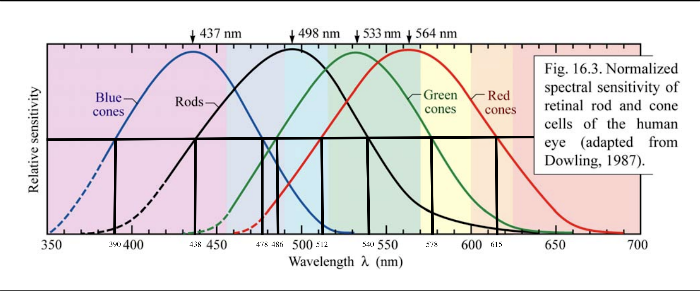

# Travel

Having had the privledge to travel domesticallu stateside and internationally in Asia, I've gotten used to traveling both heavy and light. Having done both, light is the way to go. More often than not, travelling light gives you the flexibility to carry souvineres and bring things both to and from your travel. Having family outside of the states, requests to bring something is more common than not. So learn to travel light and carry what you need: you'll need to know where you're going. Like anything else you do: know your audience.&#x20;

## Organization

I like to bring a organizational tool like a hanging shelf. This keeps your stuff in a single location which helps with keeping track of your items like clothing or utilities to prevent their loss. I have lost too many things across various countries which is a real pain.&#x20;

Do not use a hotel's shelving or drawers if you can help it: that is just a recipe to lose your stuff when you leave the area. Same advice goes for the actual act of travel on an airplane or bus: do not use the seatback pouch. You _will forget something important in them_.&#x20;

### Header 2&#x20;

\[Lipsum]

## Images







.png>)



## Resources

## References

a $$\ref{eqn:somelabel}$$

$$
\ref{eqn:somelabel}
$$

1.
