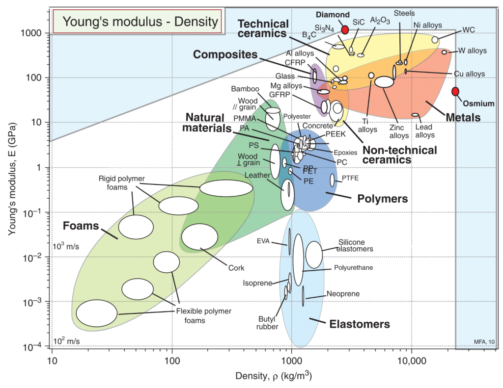

# Materials Modeling

### Lecture 1: Introduction to Material Science

Multiscale Modeling is touched on in Fluid Mechanics but here, will traverse the scale through the lectures.&#x20;

Ab Inito Methods derive materials properties from first principals or wave equation&#x20;

* Pros
  * electronic and structural behavior and properties&#x20;
  * bond breaking and formation in chemical reaction
  * can systematically improve results to prove quality
  * in principal, can obtain exact properties
*   Cons

    * very small systems, \~O(10E2) atoms
    * very small timescales, \~O(10E-12) or pico seconds
    * numerically expensive on even super computers of \~O(10E15) flops

Atomistic Methods is the range of semi classical statistical mechanics for thermodynamic and transport properties

* Pros
  * Systems larger on scale of \~O(10E4) and \~O(10E6) atoms
  *   Larger timescales of \~O(10E-9) to O(10E-6) second&#x20;

      &#x20;
* Cons
  * results depend on force field used&#x20;
  * Transport properties dependent on macroscale conditions which affect physical processes

Mesoscale methods is a level of simplification treating clusters of atoms as blobs of matter. An abstraction which allows for some computational savings by calculation as entities moving through a potential field.&#x20;

* Pros
  * Study structural features of complex systems on size \~O(10E8) or more
  * Dynamic processes on the order of a second
* Cons
  * Mostly only qualitative tendencies, with quality difficult to ascertain
  * Approximations limit insight&#x20;

Continuum Methods: assume matter can be treated as field quantity which changes continuously. Solve balance equations, per FEM and CFD.

* Pro:  rest of the time lengthscale diagram is accessible&#x20;
* Con Require viscosity, diffusion coefficients, and other transport properties

Upscaling is the using a lower lengthscale information to inform the properties of higher length scales in a deductive approach

Downscaling is using higher scale, often experimental information, to inform lower order parameters. More difficult due to non-uniqueness.

### Lecture 2: Ab Inito Principals, Fundamentals

### Lecture 3: Ab Inito and Density Functional Theory, Part 1

### Lecture 4: Ab Inito and DFT, Part 2

### Lecture 5: Linux

### Lecture 6: Ab Inito and DFT, Part 3

### Lecture 7: Molecular Dynamics (MD), Introduction

### Lecture 8: MD Introduction to Integrators

### Lecture 9: MD Force Fields and Ensembles

### Lecture 10: MD Static Properties

### Lecture 11: MD Dynamic Properties

### Lecture 12: MD Tricks of the Trade

### Lecture 13: Project Guidelines&#x20;

### Lecture 14: Introduction to Monte Carlo Methods

### Lecture 15: Ising Model

### Lecture 16: Kinetic and Reverse Monte Carlo

### Lecture 17: Brownian Dynamics

### Lecture 18: Dissipative Particle Dynamics

### Lecture 19: Continuum Methods and Beyond

