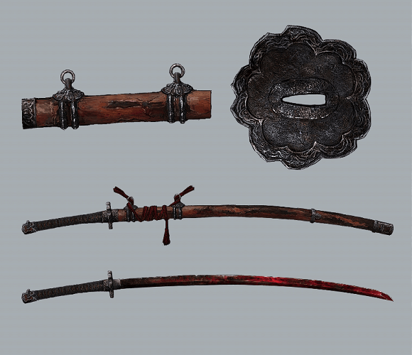
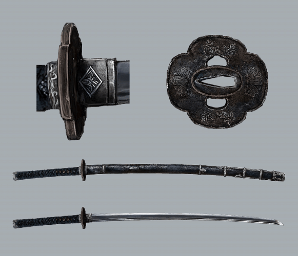

# Sekiro: Shadows Die Twice

This is the first game that I really fell in love with. It was to my detriment that it was a From Software game.&#x20;

Something about this game speaks to me. Even as it tears my computer to shreds because it doesn't have the computing power to render the graphics. Even as I smash my keys and forehead in frustration because _that should have parried!_ Something about this game is so satisfying: defeating an boss or miniboss is just elation when the deathblow marker comes up. But [fighting Genichiro](https://www.youtube.com/watch?v=E\_depF8c2B8)... &#x20;

> The intention behind the high difficulty of the games I direct is to evoke a feeling of joy and accomplishment in the player when they overcome these challenges. **-** Hidetaka Miyazaki

That really does come across. But there are plenty of difficult games. What sets Sekiro apart is the story that it tells and how the mechanics of the game are represented in the story.&#x20;

Sekiro is set in the [Sengoku ](https://en.wikipedia.org/wiki/Sengoku\_period)era of Japan, roughly between 1467 to 1615, following a nameless shinobi plucked from a lost battlefield as a child. His father, the Great Shinobi Owl trains him to obey the Iron Code. In his boss fight for the good endings, we see how Sekiro was raised:&#x20;

* **First Death:** "One! The parent is absolute. Their will must be obeyed. ...Yet I'm sensing some insubordination"&#x20;
* **Second Death:**"Two! The master is absolute. You give your life to keep him safe. You bring him back at any cost. ...At this rate, you'll lose him again"&#x20;
* **Third Death:** (only possible by Jizo Statue) "Three! Fear is absolute. There is no shame in losing one battle. But you must take revenge by any means necessary! ...I wonder if you've got it in you - to bring me down."

But how is Sekiro able to _die twice_. Because his young master, to whom his father has pledged Sekiro's allegiance is the Divine Heir Kuro: the last of a clan whose bloodline confers immortality. We see later that this is part of the crooked Owl's plot to obtain Kuro's immortality for himself. The desire for immortality is a common one, particularly as as a motivation for the antagonists of the story.&#x20;

But the cost of immortality is one that only Kuro has considered. It gives him his unique perspective on the [soul of Ashina](https://www.youtube.com/watch?v=IWgL-eozo7U), the land where this conflict takes place. He has seen the effect which his bloodline, the Dragon's Heritage, has wrought on the people: dragon rot.&#x20;

The price which is paid when Sekiro returns to life, when he _dies twice:_ death is not paid by Sekiro but those who have the misfortune of interacting with him. Dying repeatedly causes the non-player characters (NPC's) to halt their quest progression.&#x20;

> interestingly enough the player starts off with 2 nodes of resurrection but it is possible to earn another node of resurrection. Afterwards, Sekiro can die 3 false deaths before a real game over screen&#x20;

&#x20;

Sekiro's blade is Kusabimaru

### Parody Videos&#x20;

A less serious take on this game is [Sekirot](https://www.youtube.com/watch?v=31V6ifW3tNk), which accepted that we're gonna die... a lot... [CalebCity](https://www.youtube.com/watch?v=X8TfzFTM5Ys) also had a great short video as well. Additionally, my computer can't even run Sekiro anymore so at some point soon, I'm going to have to make an entertainment server.&#x20;

